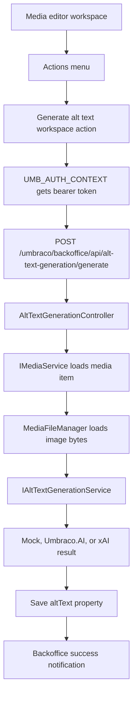

# MySite Alt Text Generation

This solution contains an Umbraco backoffice extension that can generate and save alt text for Media items.

The extension is split into two projects:

- `AltTextGen.Backoffice`: registers the backoffice UI action and contains the JavaScript that runs in the Umbraco backoffice.
- `AltTextGen.Server`: contains the authenticated backoffice API endpoint, configuration, and alt-text generation service.

`MySite` references both projects so Umbraco can discover the backoffice manifest and register the server-side services/controllers.

## Project Wiring

`MySite/MySite.csproj` references both extension projects:

```xml
<ProjectReference Include="..\AltTextGen.Backoffice\AltTextGen.Backoffice.csproj" />
<ProjectReference Include="..\AltTextGen.Server\AltTextGen.Server.csproj" />
```

The backoffice project is a Razor Class Library, so its static web assets under `wwwroot/App_Plugins` are exposed to the Umbraco backoffice. Do not also copy those files into `MySite/wwwroot`, because that creates duplicate static web asset conflicts.

## Backoffice Extension

The extension manifest is:

`AltTextGen.Backoffice/wwwroot/App_Plugins/AltTextGen/umbraco-package.json`

It registers one `workspaceAction`:

- Alias: `AltTextGen.WorkspaceAction.Media.GenerateAltText`
- Label: `Generate alt text`
- Workspace condition: `Umb.Condition.WorkspaceAlias` matching `Umb.Workspace.Media`

This means the button appears on the Media item editor workspace, usually inside the workspace `Actions` menu. It is not part of the upload dialog itself.

The action implementation is:

`AltTextGen.Backoffice/wwwroot/App_Plugins/AltTextGen/generate-alt-text.workspace-action.js`

The JavaScript:

1. Gets the current Media workspace context.
2. Enables the action only when the media item has a unique key.
3. Gets the backoffice access token from `UMB_AUTH_CONTEXT`.
4. Sends a `POST` request to `/umbraco/backoffice/api/alt-text-generation/generate`.
5. Reloads the workspace and shows a notification when the API succeeds.

The request body currently sends the media key, not the image bytes:

```json
{
  "mediaKey": "media-guid",
  "overwrite": true
}
```

This is intentional. The server can load the media item and its file value from Umbraco. Sending the image as base64 from the browser is avoided because it increases payload size and couples generation to the client UI.

## Server Extension

The API endpoint lives in:

`AltTextGen.Server/Controllers/AltTextGenerationController.cs`

The controller inherits from `UmbracoAuthorizedController`, so calls must be authenticated with the backoffice bearer token.

The route is:

```http
POST /umbraco/backoffice/api/alt-text-generation/generate
```

The controller flow is:

1. Validate that alt text generation is enabled.
2. Validate that a media key was provided.
3. Load the media item with `IMediaService`.
4. Check that the media type is allowed.
5. Check that the media item has the configured alt text property.
6. Read the existing alt text and `umbracoFile` value.
7. Load the media file bytes and MIME type from Umbraco's media file system.
8. Build an `AltTextGenerationContext`.
9. Call `IAltTextGenerationService`.
10. Save the returned alt text back to the media item.
11. Return the saved alt text to the backoffice.

The image bytes are loaded server-side from the configured Umbraco media storage. The browser sends only the media key; it does not send base64 image data.

## Generators

The extension has three generator implementations:

`AltTextGen.Server/Services/MockAltTextGenerationService.cs`

This picks a random alt-text string from an in-memory array. It is useful for testing the full backoffice-to-server flow without calling an external AI provider.

`AltTextGen.Server/Services/UmbracoAiAltTextGenerationService.cs`

This uses `Umbraco.AI` and `Microsoft.Extensions.AI` to send a multimodal chat request containing:

- a system instruction
- an alt-text prompt
- image bytes as `DataContent`

The intended provider is a Microsoft AI Foundry profile backed by a vision-capable chat model such as `gpt-4o` or `gpt-4o-mini`.

`AltTextGen.Server/Services/XAiAltTextGenerationService.cs`

This uses the OpenAI-compatible .NET chat client through `Microsoft.Extensions.AI.OpenAI`, configured with xAI's OpenAI-compatible base URL. It sends the same multimodal chat request shape as the Umbraco.AI provider:

- a system instruction
- an alt-text prompt
- image bytes as `DataContent`

The default xAI base URL is `https://api.x.ai/v1`, and it can be overridden through `AltTextGeneration:Endpoint:BaseUrl`.

## Token usage & cost estimation

Token usage is logged (when the provider returns it) by reading `Microsoft.Extensions.AI.ChatResponse.Usage`.

Important notes:

- There is **no stable conversion from “file size (MB) → tokens”**. For multimodal requests, providers meter images based primarily on **image resolution** and model-specific internal representation, not raw byte size.
- “Input tokens” typically include **both the text prompt (system + user)** and the **image component** (even though the image is not literally converted to text).
- Some providers/models may report additional buckets (for example image tokens or reasoning tokens). In those cases, **`TotalTokens` may not equal `InputTokens + OutputTokens`**.

Example from a real run (xAI, image around ~1.2MB):

```text
AltTextGen xAI token usage. MediaKey=… InputTokens=2715 OutputTokens=65 TotalTokens=3777
```

Use these three numbers to estimate cost:

- **InputTokens**: what you pay for “prompt side” (text + image)
- **OutputTokens**: what you pay for “completion side” (generated alt text)
- **TotalTokens**: provider-reported total for the call (may include extra token categories)

The service is registered in:

`AltTextGen.Server/Composition/AltTextGenerationComposer.cs`

```csharp
builder.Services.AddTransient<IAltTextGenerationService>(serviceProvider =>
{
    // Provider = Mock uses MockAltTextGenerationService.
    // Provider = UmbracoAI/MicrosoftFoundry uses UmbracoAiAltTextGenerationService.
    // Provider = xAI/Grok uses XAiAltTextGenerationService.
});
```

## Configuration

Configuration is bound from the `AltTextGeneration` section.

Current development config in `MySite/appsettings.Development.json`:

```json
"AltTextGeneration": {
  "Enabled": true,
  "Provider": "xAI",
  "ProfileAlias": "alt-text-generation",
  "OutputLanguage": "en",
  "MaxOutputTokens": 80,
  "Endpoint": {
    "BaseUrl": "https://api.x.ai/v1",
    "Model": "grok-4.20-0309-reasoning",
    "ApiKeyEnvironmentVariable": "XAI_API_KEY",
    "TimeoutSeconds": 120
  }
}
```

Defaults are defined in `AltTextGen.Server/Configuration/AltTextGenerationOptions.cs`:

- `Enabled`: `true`
- `Provider`: `Mock`
- `ProfileAlias`: optional Umbraco.AI profile alias used by the real provider
- `AltTextPropertyAlias`: `altText`
- `AllowedMediaTypeAliases`: `Image`
- `SystemPrompt`: instruction for the AI model
- `UserPrompt`: prompt sent with the image
- `OutputLanguage`: default output language as ISO 639-1 two-letter code, default `en`
- `MaxOutputTokens`: `80`
- `Endpoint.BaseUrl`: optional OpenAI-compatible endpoint override, defaulted by the xAI provider to `https://api.x.ai/v1`
- `Endpoint.Model`: model name used by direct endpoint providers such as xAI
- `Endpoint.ApiKey`: direct API key value for endpoint providers
- `Endpoint.ApiKeyEnvironmentVariable`: environment variable that contains the API key
- `Endpoint.TimeoutSeconds`: `30`

Language precedence for generated alt text is:

1. `GenerateAltTextRequest.Culture` (if present; for example `nl-NL` resolves to `nl`)
2. `AltTextGeneration:OutputLanguage` (fallback, default `en`)

The Media Type must have a property with alias `altText`, otherwise the API returns a bad request.

To use Azure AI Foundry, install/configure Umbraco.AI in the backoffice:

1. Go to **Settings** > **AI** > **Connections**.
2. Create a **Microsoft AI Foundry** connection.
3. Configure the Foundry endpoint and either API key or Entra ID credentials.
4. Create a chat profile with alias `alt-text-generation`.
5. Select a deployed vision-capable model, for example `gpt-4o` or `gpt-4o-mini`.
6. Set `AltTextGeneration:Provider` to `UmbracoAI` or `MicrosoftFoundry`.

## xAI Setup

The xAI provider is configured directly through appsettings and does not require an Umbraco.AI profile.

For local development, prefer an environment variable so the key is not committed:

```json
"AltTextGeneration": {
  "Enabled": true,
  "Provider": "xAI",
  "OutputLanguage": "en",
  "MaxOutputTokens": 80,
  "Endpoint": {
    "BaseUrl": "https://api.x.ai/v1",
    "Model": "grok-4.20-0309-reasoning",
    "ApiKeyEnvironmentVariable": "XAI_API_KEY",
    "TimeoutSeconds": 120
  }
}
```

If you intentionally store the API key in appsettings for a local-only file, use:

```json
"AltTextGeneration": {
  "Enabled": true,
  "Provider": "xAI",
  "OutputLanguage": "en",
  "MaxOutputTokens": 80,
  "Endpoint": {
    "BaseUrl": "https://api.x.ai/v1",
    "Model": "grok-4.20-0309-reasoning",
    "ApiKey": "your-xai-api-key",
    "TimeoutSeconds": 120
  }
}
```

Supported xAI provider values are:

- `xAI`
- `XAI`
- `Grok`

After changing provider or endpoint configuration, fully restart the app so the DI options validation and provider selection are rebuilt.

## Azure AI Foundry Setup

Before switching from `Mock` to the real provider, you need an Azure AI Foundry project with a deployed vision-capable chat model.

### 1. Deploy a Model

In [Microsoft AI Foundry](https://ai.azure.com):

1. Open or create an AI Foundry project.
2. Go to the model catalog.
3. Deploy a vision-capable chat model, for example:
   - `gpt-4o`
   - `gpt-4o-mini`
4. Note the deployment/model name. This is the model you select in the Umbraco.AI profile.

### 2. Collect Endpoint and Credentials

From your Azure AI Services / Foundry resource, collect:

- `Endpoint`: usually shaped like `https://your-resource.services.ai.azure.com/`
- `ApiKey`: one of the resource API keys

For production, prefer Entra ID instead of an API key. Then collect:

- `ProjectName`: the AI Foundry project name
- `TenantId`: Microsoft Entra tenant ID
- `ClientId`: service principal application/client ID
- `ClientSecret`: service principal secret

The service principal needs access to the Azure AI resource. For model inference and deployed-model listing, assign:

- `Cognitive Services OpenAI Contributor`
- `Azure AI Developer`

### 3. Store Values in Configuration

Use configuration references in Umbraco.AI instead of typing secrets directly in the backoffice fields.

For API key authentication:

```json
"MicrosoftFoundry": {
  "Endpoint": "https://your-resource.services.ai.azure.com/",
  "ApiKey": "your-api-key"
}
```

Then, in the Umbraco.AI Microsoft Foundry connection, enter:

- Endpoint: `$MicrosoftFoundry:Endpoint`
- API Key: `$MicrosoftFoundry:ApiKey`

For Entra ID authentication:

```json
"MicrosoftFoundry": {
  "Endpoint": "https://your-resource.services.ai.azure.com/",
  "ProjectName": "your-project-name",
  "TenantId": "your-tenant-id",
  "ClientId": "your-client-id",
  "ClientSecret": "your-client-secret"
}
```

Then, in the Umbraco.AI Microsoft Foundry connection, enter:

- Endpoint: `$MicrosoftFoundry:Endpoint`
- Project Name: `$MicrosoftFoundry:ProjectName`
- Tenant ID: `$MicrosoftFoundry:TenantId`
- Client ID: `$MicrosoftFoundry:ClientId`
- Client Secret: `$MicrosoftFoundry:ClientSecret`

Do not commit real API keys or client secrets to source control. Use user secrets, environment variables, or a deployment secret store for real credentials.

### 4. Create the Umbraco.AI Connection

In the Umbraco backoffice:

1. Go to **Settings** > **AI** > **Connections**.
2. Create a new connection.
3. Choose **Microsoft AI Foundry**.
4. Enter the endpoint and credential references from the previous section.
5. Save the connection.

### 5. Create the Umbraco.AI Profile

In the Umbraco backoffice:

1. Go to **Settings** > **AI** > **Profiles**.
2. Create a chat profile.
3. Set the alias to `alt-text-generation`.
4. Select the Microsoft AI Foundry connection.
5. Select the deployed vision-capable model.
6. Save the profile.

The alias must match `AltTextGeneration:ProfileAlias`.

### 6. Enable the Real Provider

Update `AltTextGeneration`:

```json
"AltTextGeneration": {
  "Enabled": true,
  "Provider": "MicrosoftFoundry",
  "ProfileAlias": "alt-text-generation"
}
```

Supported real-provider values are:

- `UmbracoAI`
- `Umbraco.AI`
- `MicrosoftFoundry`
- `Foundry`
- `xAI`
- `XAI`
- `Grok`

Any other value falls back to the mock provider.

After changing provider/profile/endpoint configuration, fully restart the app. Hot reload may not rebuild the Umbraco.AI provider/profile setup or direct provider selection.

## Runtime Flow



## Debugging

To confirm the backoffice manifest is discovered, inspect this request in the browser Network tab:

```text
/umbraco/management/api/v1/manifest/manifest/private
```

The response should include:

```text
AltTextGen.WorkspaceAction.Media.GenerateAltText
```

To confirm the JavaScript module is loaded, open the browser console and look for:

```text
[AltTextGen] workspace-action module loaded
```

To confirm the server endpoint is hit, watch the `dotnet watch` output for:

```text
AltTextGen request received...
AltTextGen media loaded...
AltTextGen generating alt text (mock)...
AltTextGen invoking xAI...
Generated alt text for media ...
```

If the button does not appear after manifest changes, fully stop and restart `dotnet watch`. Hot reload does not always rebuild Umbraco's backoffice manifest registry.

